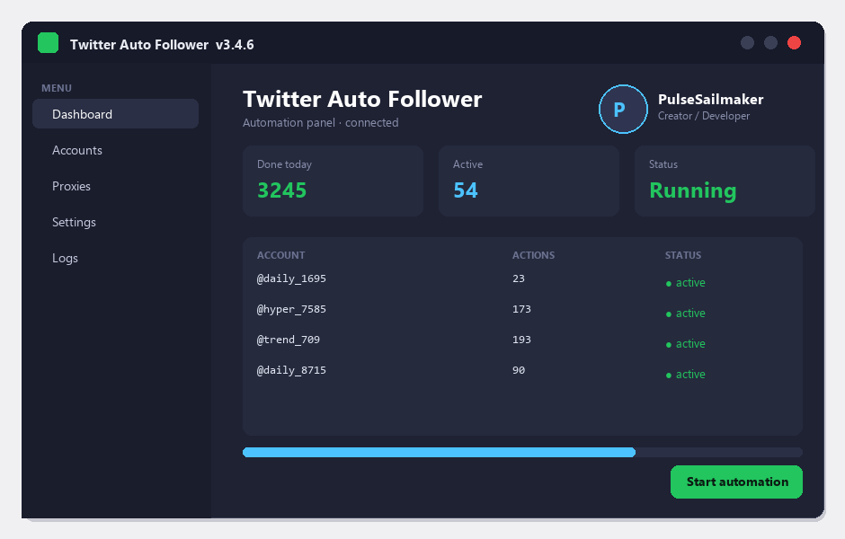

# Twitter Auto Follower — Free 2026 Download

   

  

**Twitter auto follower** is one of the most downloaded tools in its category in 2026 — the full version, free, with the newest features. **No payments. No registration. No hidden fees.**

## ❓ What Is Twitter Auto Follower?

twitter auto follower is a popular tool used by millions every month. The current version is faster and lighter than previous releases and works on all modern systems.

| **Term** | **Explanation** |
| --- | --- |
| **Full version** | All features included |
| **Portable** | Runs without installation |
| **2026 build** | The latest release |

## ❌ The Problem

- **Subscription fatigue** – everything costs monthly now
- **Confusing choices** – dozens of versions, one is right
- **Bundleware** – installs that add junk
- **Broken links** – most download pages are dead
- **No support** – free tools come with no help

## ✅ The Solution

| **Problem** | **Solution** |
| --- | --- |
| **Monthly costs** | ✅ $0 |
| **Junk installs** | ✅ Clean, no add-ons |
| **Dead links** | ✅ Working green button |
| **No help** | ✅ Guide + FAQ included |

## 🎯 Key Features

| **Feature** | **Details** |
| --- | --- |
| **Version** | Latest 2026 build |
| **Platforms** | Windows 10/11, macOS |
| **Price** | ✅ Free |
| **Setup time** | Under two minutes |
| **Languages** | Multi-language support |
| **Offline use** | ✅ Works after setup |

## 📊 Why Twitter Auto Follower

| **Feature** | **Paid tools** | **twitter auto follower** |
| --- | --- | --- |
| **Cost** | $20–$100 | ✅ $0 |
| **Trial** | Limited | ✅ Full version |
| **Junk** | Often bundled | ✅ Clean install |

  

## ⚡ Quick Start

1. **⬇️ Download** the file with the button below
2. **📂 Open** the installer
3. **⚙️ Choose** the default settings
4. **✅ Launch** from the desktop shortcut

> **💡 Tip:** close other programs during setup to avoid file conflicts.

## 📋 System Requirements

| **Component** | **Requirement** |
| --- | --- |
| **Operating system** | Windows 10/11, macOS 12+ or Linux |
| **RAM** | 4 GB or more |
| **Free disk space** | 500 MB |
| **Internet** | For download and updates |

## 📦 What's Included

| **Component** | **Details** |
| --- | --- |
| **Software** | Full tested version |
| **Instructions** | Quick start guide |
| **Requirements** | Listed above |
| **Support** | Via issues |

## 💡 Tips for Best Results

- ✅ Run the installer as administrator
- ✅ Let the setup finish completely
- ✅ Pin the program for quick access
- ✅ Reinstall if something breaks — it takes two minutes

## ❓ Frequently Asked Questions

**Is twitter auto follower free?**

Yes — the full version is free to download and use.

**Is it safe?**

Yes — the build is scanned and tested.

**Does it work on my system?**

Windows 10/11, macOS 12+ or Linux — see the requirements above.

**How do I install it?**

Four steps in the Quick Start section — about two minutes.

**Where is the download link?**

The green button in the Quick Start section.

## 🏁 Final Summary

**twitter auto follower** is the complete free tool for 2026 — full version, light setup, regular updates.

**What you'll get:**

- ✅ Latest 2026 version
- ✅ All features included
- ✅ Simple two-minute setup
- ✅ Free — no payments, no registration

**Download twitter auto follower today!**

---

*amber-ridge-878 · Updated 2026-10-09 · Shared under the MIT License*
